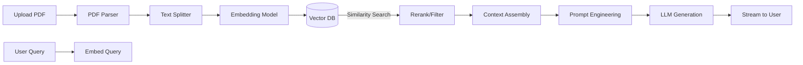

# AI Pipeline - Chunking, Embedding, Retrieval, Generation

Dokumen ini menjelaskan alur kerja AI dalam memproses dokumen hingga menghasilkan jawaban dengan model RAG (Retrieval-Augmented Generation).

---

## 1. Pipeline Overview



---

## 2. Chunking Strategy (Text Splitter)

* **Metode:** Recursive Character Splitter.
* **Chunk Size:** 500 karakter (sekitar 125 token).
* **Overlap:** 50 karakter (untuk menjaga konteks di batas potongan).
* **Alasan:** Ukuran 500 menjaga agar setiap chunk tidak terlalu besar (biaya embedding murah) namun cukup untuk menangkap paragraf utuh. Overlap mencegah hilangnya konteks di antara batas potongan kalimat.

---

## 3. Embedding Model

* **Model:** `text-embedding-3-small` (OpenAI).
* **Dimensi:** 1536.
* **Alasan:** Rasio performa dan biaya terbaik dibandingkan `text-embedding-ada-002`. Akurasi retrieval juga lebih tinggi berdasarkan benchmark MTEB.

---

## 4. Vector Search (Retrieval)

* **Metrik:** Cosine Similarity.
* **Filter:** Wajib menambahkan klausa `WHERE organization_id = ...` sebelum melakukan pencarian kesamaan untuk menjamin isolasi data antar organisasi.
* **Top-K:** Mengambil 5 chunk teratas yang paling relevan.
* **Alasan:** 5 chunk dirasa cukup untuk memberikan konteks yang memadai kepada LLM tanpa melebihi batas token konteks (8k/16k).

---

## 5. Prompt Engineering (System Prompt)

```markdown
Anda adalah asisten AI untuk perusahaan [Nama Org]. 
Anda hanya menjawab berdasarkan konteks yang diberikan di bawah ini.
Jika jawaban tidak ada di konteks, katakan "Saya tidak menemukan informasi tersebut dalam dokumen."
Sebutkan sumber dokumen di akhir jawaban.

Konteks:
---
{context}
---

Pertanyaan: {query}
Jawaban:
```

* **Alasan:** Prompt ini memaksa LLM untuk tetap berpatokan pada data pendukung (*grounded*) untuk meminimalkan halusinasi dan memastikan rujukan/sitasi selalu disertakan.

---

## 6. Stream Generation

* Menggunakan Vercel AI SDK (`streamText`) di sisi Edge Function untuk mempermudah penanganan streaming teks.
* Kirim sitasi dokumen sebagai event terpisah sebelum token teks dimulai agar UI dapat menampilkan referensi/sumber secara real-time.

---

## 7. Fallback & Error Handling

* Jika pembuatan embedding gagal karena masalah jaringan, status dokumen akan diubah menjadi `failed` dan log error akan dikirim ke sistem log Supabase.
* Jika pencarian vektor tidak menemukan chunk yang relevan (misalnya similarity score < 0.7), LLM akan mengembalikan jawaban standar *"Maaf, tidak ada data terkait"* daripada berhalusinasi.
