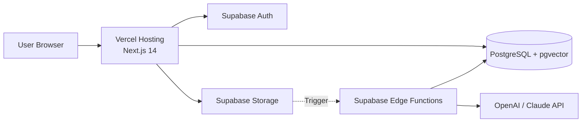
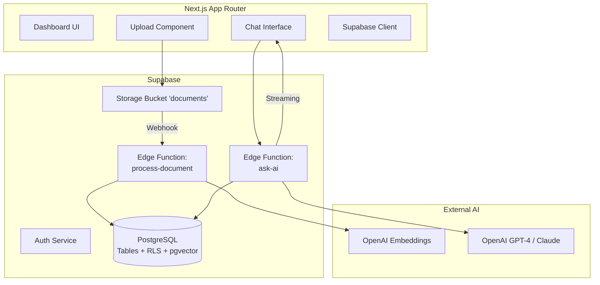
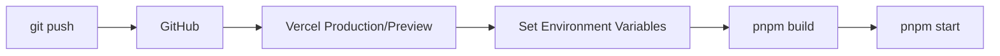
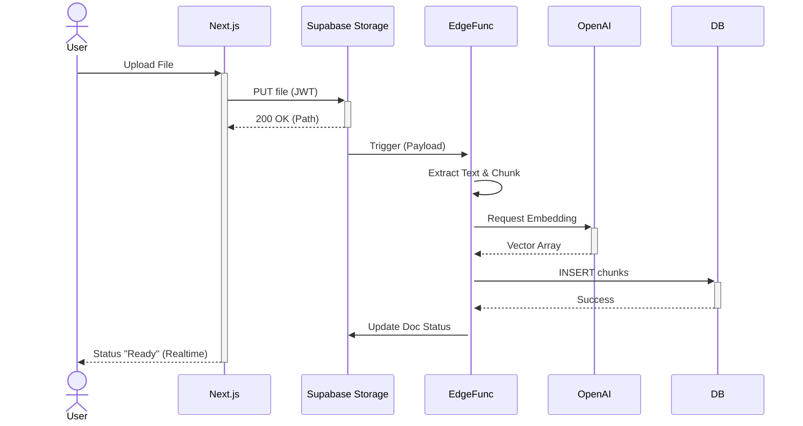
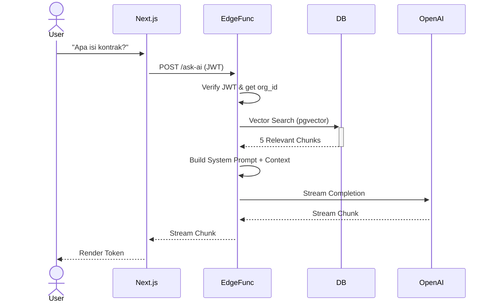

# Architecture Design - AI Knowledge Base

Dokumen ini menjelaskan arsitektur tingkat tinggi dan alur data sistem **AI Native Knowledge Base**.

---

## 1. High-Level Architecture (C4 Model - Level 1)

---

## 2. Component Diagram (Level 2)

---

## 3. Data Flow (Upload Pipeline)

1. **Upload Request**: User mengirim file ke Next.js.
2. **File Storage**: Next.js mengupload ke Supabase Storage via REST API (dengan token JWT user).
3. **Webhook Trigger**: Supabase Storage menyimpan file, lalu mengirim payload ke Edge Function `process-document`.
4. **Processing**: Edge Function membaca file dari Storage, ekstraksi teks, dan melakukan chunking.
5. **Embedding Generation**: Edge Function memanggil OpenAI Embedding API.
6. **Save to Database**: Hasil embedding disimpan di tabel `document_chunks` (PostgreSQL).
7. **Status Update**: Status dokumen diupdate menjadi `ready`.

---

## 4. Data Flow (Chat / RAG Pipeline)

1. **User Query**: User mengirim pertanyaan ke Next.js.
2. **AI Request**: Next.js memanggil Edge Function `ask-ai` dengan session JWT.
3. **Verify Auth**: Edge Function mengekstrak `organization_id` dari JWT via Supabase Auth.
4. **Vector Search**: Edge Function melakukan Vector Search (Cosine similarity) di tabel `document_chunks` dengan filter `organization_id`.
5. **Prompt Construction**: Edge Function mengambil 5 chunk teratas dan menyusunnya menjadi context prompt.
6. **LLM Generation**: Edge Function mengirim prompt ke OpenAI/Claude dengan parameter `stream: true`.
7. **Stream Response**: Edge Function mengirim balik stream response ke Next.js.
8. **UI Render**: Next.js merender response token-by-token ke UI menggunakan Vercel AI SDK.

---

## 5. Deployment Flow (Vercel)

---

## 6. Sequence Diagram: Upload

---

## 7. Sequence Diagram: Chat

---

## 8. Technology Justification

| Komponen | Pilihan | Alasan |
| :--- | :--- | :--- |
| **Frontend** | Next.js 14 | SSR untuk SEO (dashboard), API Routes minimal. |
| **DB** | Supabase (pgvector) | Managed PostgreSQL, built-in vector support, realtime. |
| **Auth** | Supabase Auth | JWT terintegrasi dengan RLS. |
| **Edge Func** | Deno / Supabase | Serverless, dekat dengan Storage (minimal latency). |
| **Package** | pnpm | Efisiensi disk space dan kecepatan CI/CD. |
