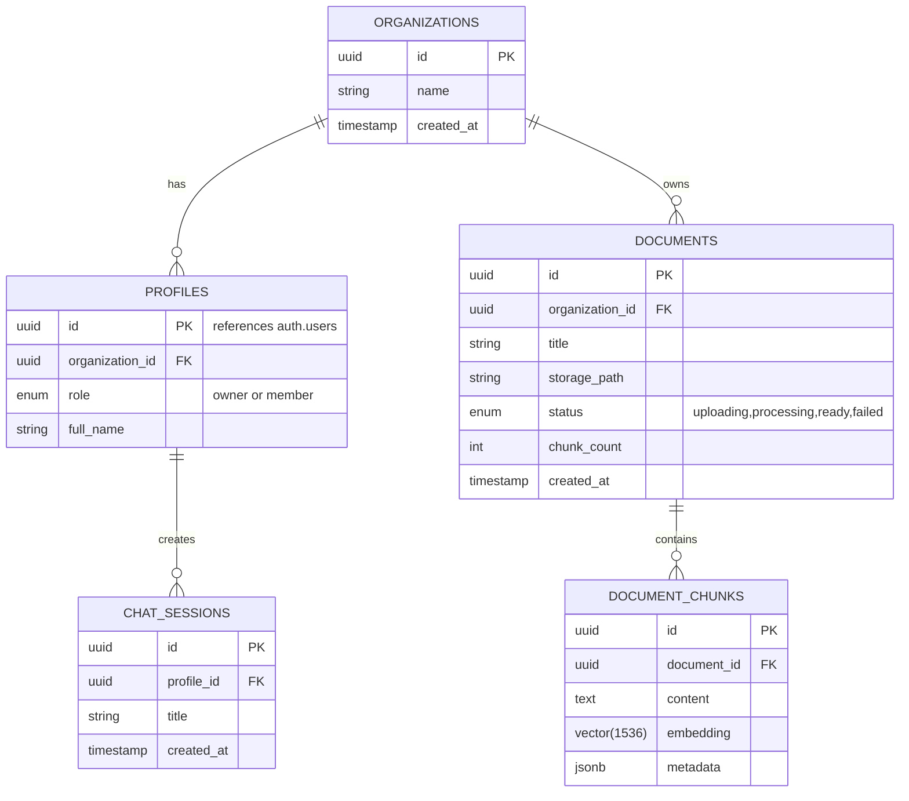

# Database Design - AI Knowledge Base

**Versi:** 1.0.0

---

## 1. Entity Relationship Diagram (ERD)



---

## 2. Extended Schema (SQL DDL)

```sql
-- Enable Extensions
CREATE EXTENSION IF NOT EXISTS vector;
CREATE EXTENSION IF NOT EXISTS pgcrypto;

-- 1. Organizations
CREATE TABLE organizations (
  id UUID PRIMARY KEY DEFAULT gen_random_uuid(),
  name TEXT NOT NULL,
  created_at TIMESTAMPTZ DEFAULT now()
);

-- 2. Profiles (extends auth.users)
CREATE TABLE profiles (
  id UUID PRIMARY KEY REFERENCES auth.users(id) ON DELETE CASCADE,
  organization_id UUID REFERENCES organizations(id) ON DELETE SET NULL,
  role TEXT DEFAULT 'member' CHECK (role IN ('owner', 'member')),
  full_name TEXT,
  created_at TIMESTAMPTZ DEFAULT now()
);

-- 3. Documents
CREATE TABLE documents (
  id UUID PRIMARY KEY DEFAULT gen_random_uuid(),
  organization_id UUID REFERENCES organizations(id) ON DELETE CASCADE,
  title TEXT NOT NULL,
  storage_path TEXT NOT NULL,
  status TEXT DEFAULT 'uploading' CHECK (status IN ('uploading','processing','ready','failed')),
  chunk_count INT DEFAULT 0,
  created_at TIMESTAMPTZ DEFAULT now()
);

-- 4. Document Chunks (Vector Store)
CREATE TABLE document_chunks (
  id UUID PRIMARY KEY DEFAULT gen_random_uuid(),
  document_id UUID REFERENCES documents(id) ON DELETE CASCADE,
  content TEXT NOT NULL,
  embedding VECTOR(1536), -- OpenAI text-embedding-3-small
  metadata JSONB DEFAULT '{}',
  created_at TIMESTAMPTZ DEFAULT now()
);

-- 5. Chat Sessions
CREATE TABLE chat_sessions (
  id UUID PRIMARY KEY DEFAULT gen_random_uuid(),
  profile_id UUID REFERENCES profiles(id) ON DELETE CASCADE,
  title TEXT DEFAULT 'New Chat',
  created_at TIMESTAMPTZ DEFAULT now()
);
```

---

## 3. Indexes (Optimasi Performa)

```sql
-- Index untuk query vector similarity
CREATE INDEX idx_chunks_embedding ON document_chunks 
  USING ivfflat (embedding vector_cosine_ops) WITH (lists = 100);

-- Index untuk filter organization_id pada dokumen (join cepat)
CREATE INDEX idx_documents_org_id ON documents(organization_id);

-- Index untuk RI (Foreign Key)
CREATE INDEX idx_chunks_doc_id ON document_chunks(document_id);
```

---

## 4. Row Level Security (RLS) - Kritis

```sql
-- Aktifkan RLS
ALTER TABLE organizations ENABLE ROW LEVEL SECURITY;
ALTER TABLE profiles ENABLE ROW LEVEL SECURITY;
ALTER TABLE documents ENABLE ROW LEVEL SECURITY;
ALTER TABLE document_chunks ENABLE ROW LEVEL SECURITY;

-- Policy 1: User hanya bisa melihat organisasi tempat dia berada
CREATE POLICY "Users view their own org" ON organizations
  FOR SELECT USING (
    id IN (SELECT organization_id FROM profiles WHERE id = auth.uid())
  );

-- Policy 2: User hanya bisa melihat dokumen di org-nya sendiri
CREATE POLICY "Users view org docs" ON documents
  FOR SELECT USING (
    organization_id IN (
      SELECT organization_id FROM profiles WHERE id = auth.uid()
    )
  );

-- Policy 3: User hanya bisa insert dokumen jika dia owner atau admin di org itu
CREATE POLICY "Admins insert docs" ON documents
  FOR INSERT WITH CHECK (
    EXISTS (
      SELECT 1 FROM profiles 
      WHERE id = auth.uid() 
      AND organization_id = organization_id 
      AND role = 'owner'
    )
  );

-- Policy 4: Chunks mengikuti policy dokumen (Security Barrier)
CREATE POLICY "Chunks follow doc policy" ON document_chunks
  FOR SELECT USING (
    document_id IN (
      SELECT id FROM documents WHERE organization_id IN (
        SELECT organization_id FROM profiles WHERE id = auth.uid()
      )
    )
  );
```

---

## 5. Migration Strategy

* Gunakan folder `supabase/migrations/` dengan format timestamp (`20240101000000_create_tables.sql`).
* Jalankan via `supabase migration up` untuk local development.
* Untuk production, migrasi otomatis via GitHub Actions atau Supabase Dashboard.
